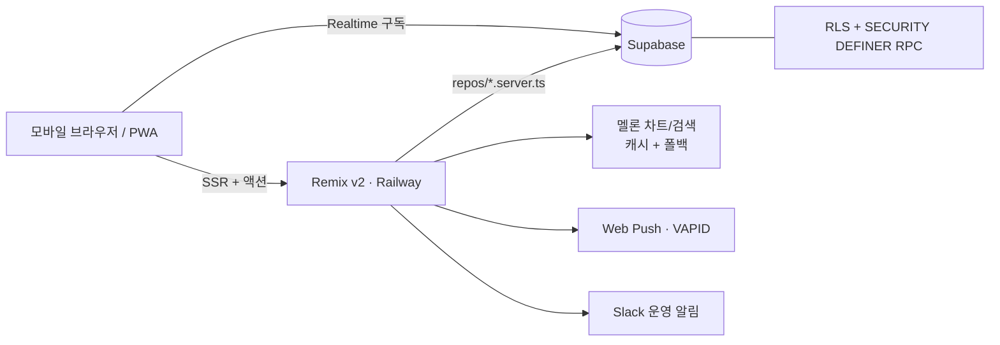

# 뮤직매치 (MusicMatch) — 포트폴리오

> 음악 취향으로 연결되는 대학생 1:1 소개팅 웹앱 (PWA)
> Remix v2 · Supabase · Railway | 2026.05 ~ 진행 중

---

## 한 줄 소개

같은 노래를 고른 이성과 매칭되어 실시간으로 채팅하는 모바일 웹 소개팅 서비스.
회원가입 → 프로필 → 승인 → 곡/장르 선택 → 매칭 → 실시간 채팅 → 푸시 알림까지 **핵심 퍼널 전체가 프로덕션에서 동작**한다.

## 규모

| 항목 | 값 |
|---|---|
| 코드 | TypeScript/TSX 약 14,000줄 + SQL 약 2,800줄 |
| 화면/라우트 | Remix 라우트 34개, 공용 컴포넌트 23개 |
| DB | Supabase Postgres, 마이그레이션 30개 (전 테이블 RLS) |
| 배포 | Railway — `main` 푸시 시 프로덕션 자동 배포 |
| 커밋 | 130+ |

## 기술 스택

- **프론트/서버**: Remix v2 (SSR) + React 18 + TypeScript — 폰 프레임 기반 모바일 웹, PWA
- **백엔드**: Supabase — Postgres · Auth · Realtime · Storage · RLS · SECURITY DEFINER RPC
- **인프라**: Railway (GitHub 연동 자동 배포), Web Push(VAPID)
- **외부 연동**: 멜론 차트/검색(melona), Slack 운영 알림, Amplitude/PostHog 분석
- **품질 도구**: k6 부하 테스트, husky pre-commit 색상 가드, tsc 타입 체크

## 핵심 기능

- **음악 기반 매칭** — 멜론 차트/검색에서 곡 최대 3개 + 장르 선택, 곡·장르 일치 기반 1:1 매칭 (교차 학교·연령·소프트 매칭 폴백 포함)
- **실시간 채팅** — Supabase Realtime 구독. 메시지 수정/삭제(soft delete), "펑"(읽으면 소멸), "한 번만 보기" 사진(1회 열람 후 스토리지 원본 삭제), 캡처 억제(워터마크·우클릭/드래그 차단·탭 이탈 가림)
- **가입 퍼널 + 승인 게이트** — 단계형 프로필 작성, 관리자 승인 후 서비스 진입, 미승인자는 대기 허브
- **둘러보기 모드** — 비로그인 방문자가 샘플 데이터로 탐색/채팅/프로필을 미리보기 → 가입 전환 유도
- **재매칭** — "한 명 더" 요청 → 운영팀 확인(pending) 모델, 매칭 풀 확장 로직
- **PWA 푸시 알림** — 매칭/메시지 알림, iOS 홈 화면 설치 유도 배너
- **프로필 사진** — 비공개 스토리지 버킷 + 서명 URL로만 노출, 매칭 상대에게만 공개하는 정책

## 기술적 도전과 해결

### 1. 매칭 동시성 — advisory lock + 부분 유니크 인덱스 + k6 검증

두 탭/더블 탭에서 "매칭 찾기"를 동시에 누르면 같은 유저가 중복 매칭되는 경합 버그가 있었다.

- `find_or_create_match` RPC에 **Postgres advisory lock**을 걸고, 락 획득 후 상태를 재확인하는 패턴으로 수정
- `matches`에 **active 쌍 부분 유니크 인덱스**를 추가해 DB 레벨에서도 중복을 차단 (이중 안전망)
- **k6 시나리오**로 검증: 시딩한 전 유저를 유저당 VU 3개로 동시 난타(더블서밋 재현) → 5xx 0건, 중복 매칭 0건을 `loadtest:verify` 스크립트로 자동 확인

### 2. 휘발성 콘텐츠 채팅 — "펑"과 한 번만 보기 사진

읽으면 사라지는 메시지("펑")와 1회 열람 사진을 구현했다.

- 열람 이벤트를 DB에 기록하고 **realtime UPDATE 구독**으로 양쪽 화면에서 동시에 소멸 처리
- "한 번만 보기" 사진은 열람 즉시 **스토리지 원본을 삭제**해 서버에도 남지 않게 설계
- 소비(consume) 제약을 SQL 제약조건으로 강제해 클라이언트 우회를 차단
- 캡처 억제: 워터마크, 우클릭/드래그 차단, 탭 이탈 시 화면 가림

### 3. 보안 — RLS 전면 적용과 최소 노출 원칙

- 전 테이블 **RLS 활성** + 정책 감사 스크립트(`rls_audit.sql`)로 정책 본문 점검
- 쓰기 경로(매칭 생성·종료, 알림 생성)는 **SECURITY DEFINER RPC/트리거**로만 허용
- 프로필 사진은 비공개 버킷 + **서명 URL**, 미승인자 회원 명단 노출 차단, 채팅 로그의 콘솔 노출 제거
- 공개 가입 액션에 **rate limit** 적용, realtime 구독에 match_id 필터로 타 매칭 브로드캐스트 차단

### 4. 외부 API 장애 대응 — 멜론 검색 캐싱 + 폴백

비공식 멜론 API(melona)는 간헐적으로 실패한다.

- 검색 결과 **인메모리 캐시(10분)** 로 반복 호출 절감
- 장애 시 **폴백 곡 목록**(`song-fallback.json`)을 필터링해 반환 → 곡 선택 퍼널이 외부 장애에도 끊기지 않음

### 5. 운영·DX 하네스 — 재발 방지를 자동화

- **색상 가드**: 폐기된 브랜드색이 커밋되면 husky pre-commit이 차단 (`lint:colors`)
- **db:apply 스크립트**: MCP/대시보드 없이도 마이그레이션을 CLI로 적용
- **분석 자가진단**: Amplitude 미수신을 배포 시점에 감지하는 부팅 진단 장치
- Slack 웹훅으로 가입/승인 운영 알림

## 데이터 분석과 개선 — Supabase + PostHog/Amplitude

계측을 직접 설계하고, 수집된 데이터로 이탈 지점을 찾아 제품을 고치는 사이클을 돌렸다.

### 계측 설계

- **PostHog + Amplitude 동시 전송 래퍼** (`analytics.client.ts` / `analytics.server.ts`) — 키가 없으면 no-op으로 안전하게 동작
- 가입·프로필 완성·곡 선택처럼 **서버 액션에서 리다이렉트되는 "성공" 지점은 브라우저 SDK로 못 잡는다** → 서버에서 ingestion API로 직접 전송하고, `distinct_id`를 auth user id로 통일해 클라이언트 identify와 같은 사람으로 병합
- **첫 방문 유입 출처(first-touch UTM·referrer·landing)를 localStorage에 1회 저장** 후 person 속성에 부착 — 출처별 가입/매칭 퍼널 분석 가능
- **트래킹 플랜을 문서로 먼저 설계**(`.telemetry/` — 이벤트 14개 + user 트레잇, object.action 네이밍 컨벤션) 후 구현 — 이벤트 난립 방지
- Supabase DB(matches·messages·profiles)를 SQL로 직접 분석하고, **Chart.js 기반 자체 분석 대시보드**로 KPI·퍼널 시각화

### 분석 → 개선 사례

| 데이터에서 발견한 문제 | 개선 |
|---|---|
| 가입 직후 이탈이 심각 — **단일 세션 비율 84%**, 승인 대기 페이지가 막다른 길 | 대기 화면을 **"대기 중 할 일" 허브**로 전환 — 곡 고르기(매칭 품질↑)·둘러보기 CTA로 재방문 동기 부여 |
| 가입 퍼널 중도 이탈 — 입력 항목이 많고 결제가 가치 경험보다 먼저 등장 | **퍼널 단축**: 필수 입력을 핵심 4개 필드로 축소, 전공·사진 등은 가입 후로 이연. **곡 선택을 결제 앞으로 이동**해 가치를 먼저 경험시킨 뒤 참가비 안내 |
| 비로그인 방문자가 서비스 내용을 못 보고 이탈 | **둘러보기 모드** — 샘플 데이터로 탐색·채팅·프로필 미리보기 후 가입 CTA |
| 프로필 사진 요구가 가입 이탈을 키우는지 불확실 | **A/B 실험으로 검증** — PostHog 피처플래그 기반 `useExperiment` 훅을 만들어 사진 업로드 필수 여부를 실험 |
| Amplitude 이벤트 미수신을 배포 후에야 발견 | 응답 status 검증 + **부팅 자가진단** 장치로 계측 장애를 즉시 감지 |

## 아키텍처

- DB 접근은 `src/lib/repos/*.server.ts`에만 위치 — 라우트에서 직접 쿼리 금지
- 서버 전용 코드는 `*.server.ts` 규약으로 클라이언트 번들 유입 차단
- 디자인 토큰(`COLORS`/`TYPOGRAPHY`)으로 색·타이포 단일 기준 유지

## 배운 점

- **동시성 버그는 코드 리뷰가 아니라 부하 테스트로 잡힌다** — advisory lock을 넣는 것보다, k6로 경합을 재현해 "5xx 0건·중복 0건"을 수치로 증명하는 과정이 더 중요했다.
- **보안은 기능이 아니라 기본값** — RLS를 켜두는 것과 정책 본문이 실제로 최소 권한인지 감사하는 것은 다른 일이었다.
- **외부 의존성은 반드시 실패한다** — 비공식 API 위에 기능을 쌓을 때 캐시와 폴백을 처음부터 설계에 포함해야 퍼널이 살아남는다.
- **재발 방지는 사람이 아니라 훅이 한다** — 같은 실수(색상 혼용, 마이그레이션 누락)가 반복되자 pre-commit 가드와 스크립트로 프로세스에 박아 해결했다.
- **개선은 감이 아니라 지표에서 시작한다** — "단일 세션 84%" 같은 수치가 있어야 어디를 고칠지 정할 수 있었고, 확신이 없는 결정(사진 필수 여부)은 A/B 실험으로 데이터가 답하게 했다.

---

*저장소: `iluv4/music-dating-app-keonuu` · 상세 문서: [ONBOARDING.md](ONBOARDING.md) · [HANDOVER.md](HANDOVER.md)*
